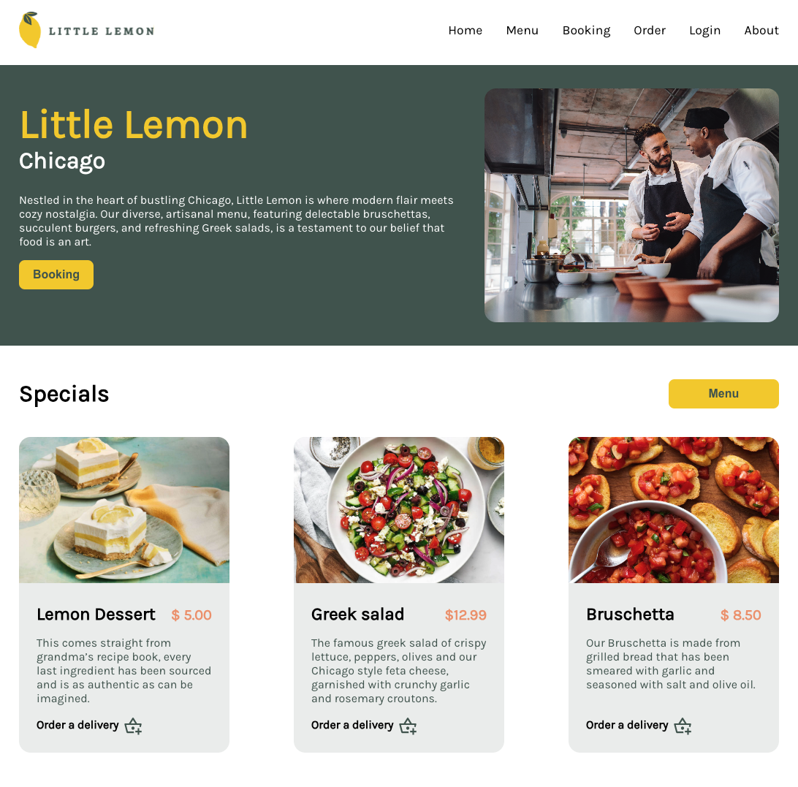

# Meta Front-End Developer Capstone Assignment: Little Lemon :lemon:

Welcome to my project repository. This project was in Meta Frontend Developer Capstone course.

## Checklist

- Followed the design and implementation of the UX UI
- Added appropriate accessibility tags
- Added unit tests
- Added the validation of booking form: First Name, Last Name, Email in booking form are validated by Formik and Yup packages
- Added the semantics and responsiveness of the web
- Project is pushed to Github.

## Available commands and pages

In the project directory, you can run:

### `npm install`

install all the packages

### `npm start`

Runs the app in development mode.\
Open [http://localhost:3000](http://localhost:3000) to view it in your browser.

### `available buttons and pages`

- only Home and Booking pages available, others will display `Page is in maintenance`
- Only Booking button in Homepage available, others will display `Page is in maintenance`

### `npm test`

Start the unit tests of Header and Footer.

## Thank you for review, Good luck!
